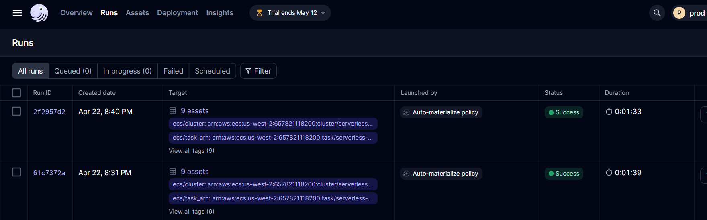

# Heart Rate Stream to Data Warehouse

<p align="center">
    
</p>

## Table of Contents
- [Overview](#overview)
- [Project Components](#project-components)
  - [Synthetic OLTP Data Generation](#1-synthetic-oltp-data-generation)
  - [Simulated Heart Rate Stream](#2-simulated-heart-rate-stream)
  - [Streaming to Kafka](#3-streaming-to-kafka)
  - [Sinking to S3](#4-sinking-to-s3)
  - [Ingestion with Airbyte](#5-ingestion-with-airbyte)
  - [Transformation with dbt](#6-transformation-with-dbt)
  - [Orchestration with Dagster](#7-orchestration-with-dagster)
  - [Tableau Semantic Layer](#8-tableau-semantic-layer)
- [Implementation](#implementation)
- [Screenshots](#screenshots)
- [Limitations and Next Steps](#limitations-and-next-steps)

## Overview

This project implements a data pipeline for historical analysis of heart rate data, primarily catering to medical and research specialists studying cardiovascular health. 

The pipeline begins with the generation of synthetic heart rate data, which is streamed to a Kafka topic for real-time processing and sinked to a cloud data lake for persistant storage. 

The data is then incrementally ingested into a data warehouse where it is transformed and stored in a final state tailored for efficient querying and analysis.

The following research questions could be answered with the warehoused data:

- How does heart rate vary across different activities for users of different demographics and/or regions?

- Can historical heart rate data provide insights into the impact of seasonal variations on heart rate patterns among different users?

- Can historical heart rate data be used to predict the likelihood of specific activities occurring at certain times of the day within different regions?

## Project Components:


### 1. Synthetic OLTP Data Generation 

Synthetic operational data is generated (users data, activities data) that will be used to provide further context to each heart rate stream record. 

The users and activities data were generated using the Faker library inside custom python scripts that can be adjusted and re-used when needed. Each script generates a pandas DataFrame object and uploads the object as a static CSV file. The CSV data is then manually uploaded to a mock operational OLTP database (running on PostgreSQL) hosted on an RDS instance. 

Further information with regards to the synthetic OLTP data may be found inside the `mock-data/static` directory.

To run the python scripts and re-create the CSV files:

`python -m mock-data.static.scripts.generate-activities`

`python -m mock-data.static.scripts.generate-users`

### 2. Simulated Heart Rate Stream

Synthetic heart rate data is generated to simulate real-world scenarios, such as heart rate data measured by an Apple Watch device. 

A `producer.py` script has been developed to act as a Kafka producer, leveraging the `confluent-kafka` Python library to generate the heart rate data. This script reads the already generated users and activities CSV files to pick out a random activity ID and user ID, sending it along with a randomly-generated heart rate to the Kafka topic. 

The script has been containerized inside a Docker image using a `Dockerfile` located in the root folder of the project, which is then pushed into Amazon ECR and ran using a continuously-running ECS task.

The Faker library is again used inside the `producer.py` script to generate a random latitude and longitude coordinates based on the user's address country. This as well as a timestamp column (indicating the event time) are added to the heart rate data record and sent as a JSON object to the Kafka topic for processing. 

Heart rate data format: 

```
{
 user_id: 10001, 
 heart_rate: 128, 
 timestamp: 1711943972, 
 meta: {
  activity_id: 20890,
  location: {latitude: 37.416834, longitude: -121.975002}
 }
}
```

Both JSON and AVRO formats were considered for sending heart rate records, however JSON was chosen as it incurred lower storage costs compared to AVRO when transmitting heart rate data over the network.

To run a custom made script to generate JSON and AVRO files with mock heart rate data:  

`python -m docs.performance-analysis.stream.compare-avro-json`

Comparing the size of the generated files:  


### 3. Streaming to Kafka

A Kafka cluster and topic were established for real-time data ingestion inside of Confluent Cloud. The topic was divided into 6 partitions, enabling Kafka to parallelize the stream processing and allow for scalability (not truly necessary as data was written synchronously inside the `producer.py` script). The default value of '1 Week' was selected as the retention period for each message. 

Confluent Cloud's connectors facilitated the setup of an S3 sink connector for efficient data transfer to an S3 bucket. An IAM role was configured to grant Confluent the necessary permissions to write data to the S3 bucket. 

Kafka topic data lineage: 


### 4. Sinking to S3

The S3 bucket partitions and stores the streamed data by its event time (YYYY/MM/DD/HH directory format). Then, within each directory, a separate JSON file is created for each partition which stores the stream data relevant to that specific partition. 

The decision to use a cloud data lake to persistently store the raw streaming data enables reusability of the data for subsequent workflows, such as machine learning pipelines operating on raw data. Additionally, if data is corrupted somewhere within the load or transformation part of the ELT pipeline, it is always possible revert to the original, unaltered data for reprocessing or troubleshooting purposes.


### 5. Ingestion with Airbyte

An EC2-deployed Airbyte instance is used to ingest the static operational RDS data and the unbounded S3 stream data into the data warehouse hosted on Snowflake.

For the S3 to Snowflake sync, first an S3 source is established with the following configurations:

```
| Config Name                      | Config Value     |
|----------------------------------|------------------|
| Bucket                           | <name-of-bucket> |
| Format                           | Jsonl format     |
| Name                             | heart_rate_stream|
| Globs                            | **               |
| Days to sync if history is full  | 3                |
| Input schema                     | N/A              |
| Schemaless                       | Unselected       |
| Validation policy                | Emit record      |
```

The selected replication sync mode for the S3 -> Snowflake connection is `Incremental | Append` with the Airbyte-generated `_ab_source_file_last_modified` column used as the cursor field. Inside AWS's Identity Access Management, a separate *airbyte-stream-reader* user was created with read access to the S3 bucket. 

For the PostgreSQL to Snowflake sync, CDC configuration was added to detect incremental inserts, updates, and hard-deletes from the source database. Then, instead of using the automatically-configured replication sync mode of `Incremental | Append + Deduped` (which would overwrite updated records based on the source table primary key), we use an `Incremental | Append` sync mode in order to keep all previous instances of a specific record, which will help us with the Type 2 Slowly Changing Dimension implementation in our data warehouse.

Both connections load the data inside `raw` schema of our warehouse database, where the tables are incrementally appended to each time Airbyte extracts new records from the source files/tables. 

Manual replication mode is used for both connections as the decision of when to trigger the sync is left to the selected data orchestration tool (Dagster).


### 6. Transformation with dbt

Data transformation tasks are performed using a dbt (Data Build Tool) project, whose files can be found inside the `transform/` directory. 

To streamline development and production environments, the project leverages two profiles defined in `profiles.yml`: `dev` and `prod`. To target specific profiles use the following commands: 

- `dbt build --target dev`
- `dbt build --target prod`

The data assets generated or inherited by dbt were broken down into three different stages (sources, staging, serving), the files for which can be found inside the `transform/models` directory. 

The three source tables are defined in the `sources.yml` file, as well as the descriptions and comprehensive data quality tests for each of their fields. The data quality tests consist of out-of-the-box dbt tests, tests found in the `dbt_expectations` package, as well as self-defined SQL test files (singular and generic) which can be found inside the `tests` folder. Thorough testing of source assets was done in order to ensure their integrity and data quality as early as possible, allowing the pipeline to detect and address issues before they have a chance to impact downstream processes.

A seed file (`country_codes.csv`) was added to test if the source users data table correctly maps country codes to appropriate country names. The seed file installation is facilitated through `dbt seed`, enhancing our data validation efforts. The seed file as well as a `schema.yml` file (to document and test the seed) can be found inside the `transform/seeds` folder. 

The three staging tables are defined in the `staging.yml` file located in the `models/staging` folder, and serve as intermediary storage for incoming raw data. They perform initial transformations on the source tables such as column selection, column renaming, data type casting, as well as basic filtering to prepare the data for downstream processing. All of the staging models are configured to be incremental, allowing dbt to select only newly appended rows based on the `_airbyte_extracted_at` field and insert them into the appropriate table.  

Staging table with incremental materialization template:

```sql
{{
    config(
        materialized="incremental",
        incremental_strategy='append'
    )
}}

select
    _airbyte_extracted_at::timestamp_ntz as extracted_at

from 
    {{ source_table_name }} 


    where extracted_at > (select max(extracted_at) from {{ this }} )


```

The final serving tables are defined in the `serving.yml` file located in the `models/serving` directory, where the models are organized into fact and dimension tables. 

The `dim_dates` (generated by the calogica/dbt_date package and with a grain in days) and `dim_times` (generated through custom SQL code and with a grain in seconds) are meant to be built only once and persisted in the data warehouse. Since these tables are auto-generated and have not been tested in previous layers, thorough testing is once again performed against these models to ensure the integrity of each of their data records. The `dim_dates` dimension by itself carries 93 different data quality tests. Thus, to not run the tests each time when testing other models (due to compute costs), it is advisable to use the dbt `--exclude` flag:

- `dbt build --exclude "dim_dates" "dim_times"`
- `dbt test --exclude "dim_dates" "dim_times"`

The `dim_users` and `dim_activities` dimension tables are extensions of their staging counterparts, with the addition of a surrogate key for each record as well as SQL logic to implement both models as Type 2 Slowly Changing Dimension (SCD) tables. This is achieved by creating `start_date` and `end_date` fields (with the help of Airbyte CDC-generated columns) that serve to capture the validity period of each record, enabling historical tracking of changes over time. All currently active records have an `end_date` value of *`NULL`*.

The `fct_heart_rates` fact table contains each heart rate transaction record, but can only declare the corresponding user and activity IDs from the OLTP database, and not to the surrogate key that maps to the relevant version of each business key. Therefore, a join has to be performed to map the record to its appropriate surrogate key, which is achieved by verifying if the heart rate event timestamp (`event_datetime`) is between the `start_date` and `end_date` fields of the ID record. 

```json
{{
  config(
    cluster_by=['event_date'],
    ...
  )
}}
```

The above clustering key configuration is additionally applied to the `fct_heart_rates` table in order to group records with the same `event_date` column within the Snowflake same micro partition. As the fact table is meant to eventually contain *millions* if not *billions* of rows, a clustering key needs to be added to optimize query performance for our analysts (who will most likely want to order or filter the heart rate data for specific dates or date ranges). 


 

### 7. Orchestration with Dagster

Dagster (hosted on Dagster Cloud) was chosen as our orchestrator tool due to its asset-based orchestration capabilities and seamless integration with dbt and Airbyte. A Dagster project was created, the underlying files for which can be found in the `orchestrate` directory as well as the root folder of the project. Additionally, Dagster Cloud generates GitHub Actions Workflows which can be found in the `.github/workflows` directory.

Dagster automatically generates a `setup.py` file (located in the project root folder), which was configured to include necessary packages. Run `pip install -e ".[dev]"` to install the necessary dependencies. Run `dagster dev` to start the locally-hosted Dagster UI. 

Assets necessary to run our data orchestration workflow are defined inside the `orchestrate/assets` folder. For this project we only wanted to orchestrate and schedule our Airbyte and dbt assets. 

Inside of `assets/airbyte/airbyte.py`, assets are loaded from our EC2-hosted Airbyte instance using the `load_assets_from_airbyte_instance` function, which connects to the instance using the environment variables passed in Dagster Cloud. The `AutoMaterializePolicy.eager()` configuration is added to all of our Airbyte assets as well as a `key_prefix="raw"` in order to tell Dagster to process these assets as the ones defined in our dbt `sources.yml` file. 

Assets based on the models and seeds from our dbt project are defined in `assets/dbt/dbt.py`. The assets are generated based on the `manifest.json` file dbt compiles for Dagster, which occurs every time the assets are refreshed in Dagster Cloud. However, for production use cases it is recommended to store a pre-built version of the `manifest.json` file in the project repository, in order to avoid the overhead of recompiling the dbt project each time and to avoid potentially inadvertent errors. 

Additionally, a `dagster_cloud_post_install.sh` file was loaded (and made executable using the `chmod +x` command) into the root directory of our project in order to successfully run the `dbt deps` command and install necessary dbt packages when deploying to Dagster Cloud Serverless. The Dagster-generated `deploy.yml` and `branch_deployments.yml` GitHub workflows files were also modified to disable fast deploys (`ENABLE_FAST_DEPLOYS: 'false'`). 

Dagster's `Auto-Materialize` policy feature was used in order to schedule and orchestrate the assets. Inside of the `fct_heart_rates` model stored in our dbt project, we added the following config code at the top of the file: 

```json
{{
  config(
    ... ,
    meta={
        "dagster":{
            "freshness_policy": {
                "maximum_lag_minutes": 1,
                "cron_schedule": "30 2 * * *"
            },
            "auto_materialize_policy": {
                "type": "eager"
            },
            "group": "dbt_warehouse"
        }
    }
  )
}}
```

This tells Dagster to refresh and re-run the the asset every day at 2:30 AM UTC time. Additionally, inside of `sources.yml`, `staging.yml`, and `serving.yml` an `auto_materialize_policy` of type `eager` was added to all models upstream of the `fct_heart_rates` table in our DAG (i.e. all models except for `dim_dates` and `dim_times`), telling Dagster to also refresh and re-run all of those models in order to meet our fact table's freshness policy. 

**PLEASE NOTE**:

- You need to first flip a toggle in the Dagster UI to enable assets to be auto materialized. 
- During development a Dagster-side bug prevented `Auto-materialize` to compile for Airbyte-based assets. This bug has now been resolved. 
- Since the EC2 instance hosting Airbyte is not continuously running but rather manually launched and stopped, Dagster GitHub workflows fail whenever the `AIRBYTE_HOST` environment variable is pointing to the previous IP address. The variable needs to be changed to the new IP address.




### 8. Tableau Semantic Layer


[Tableau workbook link](https://prod-uk-a.online.tableau.com/#/site/kozhakhmetovmadyarc93986ed13/workbooks/856915?:origin=card_share_link)

## Implementation

## Screenshots


Preview of the `raw.users` table:


Preview of the `raw.activities` table:


Preview of the `raw.heart_rate_stream` table:


## Limitations and Next Steps

To enhance the `producer.py` script, consider modifying it to connect to the RDS-hosted PostgreSQL database using SQLAlchemy instead of reading data from CSV files. This approach can provide real-time access to the most up-to-date user and activity data stored in the database, improving the accuracy and timeliness of the generated heart rate stream.

#### Known Issues

