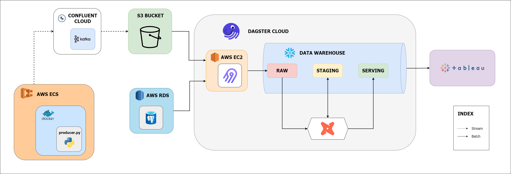

# Heart Rate Stream to Data Warehouse

<p align="center">
    
</p>

## Overview

This project implements a data pipeline for historical analysis of heart rate data, primarily catering to medical and research specialists studying cardiovascular health. 

The pipeline begins with the generation of synthetic heart rate data, which is streamed to a Kafka topic for real-time processing and sinked to a cloud data lake for persistant storage. 

The data is then incrementally ingested into a data warehouse where it is transformed and stored in a final state tailored for efficient querying and analysis.

The following research questions could be answered with the warehoused data:

- How does heart rate vary across different activities for users of different genders?

- Are there discernible trends in heart rate variability among users of different blood types across various regions?

- Can historical heart rate data provide insights into the impact of seasonal variations on heart rate patterns among different user demographics?

- Can historical heart rate data be used to predict the likelihood of specific activities occurring at certain times of the day within different regions?

- Can historical heart rate data be used to forecast potential changes in heart rate patterns as users age or undergo changes in weight or height?

## Project Components:



### 1. Synthetic OLTP Data Generation 

Synthetic operational data is generated (users data, activities data) that will be used to provide further context to each heart rate stream record. 

The users and activities data were generated using the Faker library inside custom python scripts that can be adjusted and re-used when needed. Each script generates a pandas DataFrame object and uploads the object as a static CSV file. The CSV data is then manually uploaded to a mock operational OLTP database (running on PostgreSQL) hosted on an RDS instance. 

Further information with regards to the synthetic OLTP data may be found inside the `mock-data/static` directory.

To run the python scripts and re-create the CSV files:

`python -m mock-data.static.scripts.generate-activities`

`python -m mock-data.static.scripts.generate-users`

### 2. Simulated Heart Rate Stream

Synthetic heart rate data is generated to simulate real-world scenarios, such as heart rate data measured by an Apple Watch device. 

A `producer.py` script has been developed to act as a Kafka producer, leveraging the `confluent-kafka` Python library to generate the heart rate data. This script reads the already generated users and activities CSV files to pick out a random activity ID and user ID, sending it along with a randomly-generated heart rate to the Kafka topic.

The Faker library is also used to generate a random latitude and longitude coordinates based on the user's address country. This as well as a timestamp column (indicating the event time) are added to the heart rate data record and sent as a JSON object to the Kafka topic for processing. 

Heart rate data format: 

```
{
 user_id: 10001, 
 heart_rate: 128, 
 timestamp: 1711943972, 
 meta: {
  activity_id: 20890,
  location: {latitude: 37.416834, longitude: -121.975002}
 }
}
```

Both JSON and AVRO formats were considered for sending heart rate records, however JSON was chosen for its simplicity and cost-effectiveness. While AVRO offers schema evolution and binary encoding, JSON ended up incurring lower storage costs compared to AVRO for transmitting heart rate data over the network.

To run a custom made script to generate JSON and AVRO files with mock heart rate data:  

`python -m docs.performance-analysis.stream.compare-avro-json`

Comparing the size of the generated files:  


### 3. Streaming to Kafka

A Kafka cluster and topic were established for real-time data ingestion inside of Confluent Cloud. The topic was divided into 6 partitions, enabling Kafka to parallelize the stream processing and allow for scalability (not truly necessary as data was written synchronously inside the `producer.py` script). The default value of '1 Week' was selected as the retention period for each message. 

Confluent Cloud's connectors facilitated the setup of an S3 sink connector for efficient data transfer to an S3 bucket. An IAM role was configured to grant Confluent the necessary permissions to write data to the S3 bucket. 


### 4. Sinking to S3

The S3 bucket partitions and stores the streamed data by its event time (YYYY/MM/DD/HH directory format). This approach enables reusability of the data for subsequent workflows, such as machine learning pipelines operating on raw data. 

### 5. Ingestion with Airbyte

Airbyte is used to ingest the static operational RDS data and the unbounded S3 stream data into the data warehouse hosted on Snowflake.

### 6. Transformation with dbt

Data transformation tasks are performed using dbt (Data Build Tool). The transformation tasks are broken down into different stages (staging, serving) and the data is broken into different models adopting a Kimball-style star schema design.

### 7. Star Schema Modeling

This design optimizes query performance and facilitates intuitive analysis by organizing data into fact and dimension tables. 

- Fact tables contain measurable data (heart rate measurements), while dimension tables provide context (user information, timestamp details). 
- Certain dimension tables are implemented as Type 2 Slowly Changing Dimension (SCD) enabling historical tracking of dimensional data (e.g. difference in heart rate for when a user has recorded a change in weight). 

### 8. Tableau Semantic Layer


## Implementation

## Screenshots


## Limitations and Next Steps

To enhance the `producer.py` script, consider modifying it to connect to the RDS-hosted PostgreSQL database using SQLAlchemy instead of reading data from CSV files. This approach can provide real-time access to the most up-to-date user and activity data stored in the database, improving the accuracy and timeliness of the generated heart rate stream.