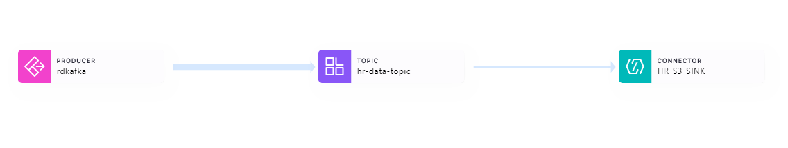

# Heart Rate Stream to Data Warehouse

<p align="center">
    
</p>

## Table of Contents
- [Overview](#overview)
- [Project Components](#project-components)
  - [Synthetic OLTP Data Generation](#1-synthetic-oltp-data-generation)
  - [Simulated Heart Rate Stream](#2-simulated-heart-rate-stream)
  - [Streaming to Kafka](#3-streaming-to-kafka)
  - [Sinking to S3](#4-sinking-to-s3)
  - [Ingestion with Airbyte](#5-ingestion-with-airbyte)
  - [Transformation with dbt](#6-transformation-with-dbt)
  - [Orchestration with Dagster](#7-orchestration-with-dagster)
  - [Tableau Semantic Layer](#8-tableau-semantic-layer)
- [Implementation](#implementation)
- [Screenshots](#screenshots)
- [Limitations and Next Steps](#limitations-and-next-steps)

## Overview

This project implements a data pipeline for historical analysis of heart rate data, primarily catering to medical and research specialists studying cardiovascular health. 

The pipeline begins with the generation of synthetic heart rate data, which is streamed to a Kafka topic for real-time processing and sinked to a cloud data lake for persistant storage. 

The data is then incrementally ingested into a data warehouse where it is transformed and stored in a final state tailored for efficient querying and analysis.

The following research questions could be answered with the warehoused data:

- How does heart rate vary across different activities for users of different genders?

- Are there discernible trends in heart rate variability among users of different blood types across various regions?

- Can historical heart rate data provide insights into the impact of seasonal variations on heart rate patterns among different user demographics?

- Can historical heart rate data be used to predict the likelihood of specific activities occurring at certain times of the day within different regions?

- Can historical heart rate data be used to forecast potential changes in heart rate patterns as users age or undergo changes in weight or height?

## Project Components:


### 1. Synthetic OLTP Data Generation 

Synthetic operational data is generated (users data, activities data) that will be used to provide further context to each heart rate stream record. 

The users and activities data were generated using the Faker library inside custom python scripts that can be adjusted and re-used when needed. Each script generates a pandas DataFrame object and uploads the object as a static CSV file. The CSV data is then manually uploaded to a mock operational OLTP database (running on PostgreSQL) hosted on an RDS instance. 

Further information with regards to the synthetic OLTP data may be found inside the `mock-data/static` directory.

To run the python scripts and re-create the CSV files:

`python -m mock-data.static.scripts.generate-activities`

`python -m mock-data.static.scripts.generate-users`

### 2. Simulated Heart Rate Stream

Synthetic heart rate data is generated to simulate real-world scenarios, such as heart rate data measured by an Apple Watch device. 

A `producer.py` script has been developed to act as a Kafka producer, leveraging the `confluent-kafka` Python library to generate the heart rate data. This script reads the already generated users and activities CSV files to pick out a random activity ID and user ID, sending it along with a randomly-generated heart rate to the Kafka topic.

The Faker library is also used to generate a random latitude and longitude coordinates based on the user's address country. This as well as a timestamp column (indicating the event time) are added to the heart rate data record and sent as a JSON object to the Kafka topic for processing. 

Heart rate data format: 

```
{
 user_id: 10001, 
 heart_rate: 128, 
 timestamp: 1711943972, 
 meta: {
  activity_id: 20890,
  location: {latitude: 37.416834, longitude: -121.975002}
 }
}
```

Both JSON and AVRO formats were considered for sending heart rate records, however JSON was chosen as it incurred lower storage costs compared to AVRO when transmitting heart rate data over the network.

To run a custom made script to generate JSON and AVRO files with mock heart rate data:  

`python -m docs.performance-analysis.stream.compare-avro-json`

Comparing the size of the generated files:  


### 3. Streaming to Kafka

A Kafka cluster and topic were established for real-time data ingestion inside of Confluent Cloud. The topic was divided into 6 partitions, enabling Kafka to parallelize the stream processing and allow for scalability (not truly necessary as data was written synchronously inside the `producer.py` script). The default value of '1 Week' was selected as the retention period for each message. 

Confluent Cloud's connectors facilitated the setup of an S3 sink connector for efficient data transfer to an S3 bucket. An IAM role was configured to grant Confluent the necessary permissions to write data to the S3 bucket. 

Kafka topic data lineage: 



### 4. Sinking to S3

The S3 bucket partitions and stores the streamed data by its event time (YYYY/MM/DD/HH directory format). Then, within each directory, a separate JSON file is created for each partition which stores the stream data relevant to that specific partition. 

The decision to use a cloud data lake to persistently store the raw streaming data enables reusability of the data for subsequent workflows, such as machine learning pipelines operating on raw data. Additionally, if data is corrupted somewhere within the load or transformation part of the ELT pipeline, it is always possible revert to the original, unaltered data for reprocessing or troubleshooting purposes.

S3 bucket file structure:


### 5. Ingestion with Airbyte

An EC2-deployed Airbyte instance is used to ingest the static operational RDS data and the unbounded S3 stream data into the data warehouse hosted on Snowflake.

For the S3 to Snowflake sync, first an S3 source is established with the following configurations:

```
| Config Name                      | Config Value     |
|----------------------------------|------------------|
| Bucket                           | <name-of-bucket> |
| Format                           | Jsonl format     |
| Name                             | heart_rate_stream|
| Globs                            | **               |
| Days to sync if history is full  | 3                |
| Input schema                     | N/A              |
| Schemaless                       | Unselected       |
| Validation policy                | Emit record      |
```

The selected replication sync mode for the S3 -> Snowflake connection is `Incremental | Append` with the Airbyte-generated `_ab_source_file_last_modified` column used as the cursor field. Inside AWS's Identity Access Management, a separate *airbyte-stream-reader* user was created with read access to the S3 bucket. 

For the PostgreSQL to Snowflake sync, CDC configuration was added to detect incremental inserts, updates, and hard-deletes from the source database. Then, instead of using the automatically-configured replication sync mode of `Incremental | Append + Deduped` (which would overwrite updated records based on the source table primary key), we use an `Incremental | Append` sync mode in order to keep all previous instances of a specific record for the future Type 2 Slowly Changing Dimension implementation in our data warehouse.

Both connections load the data inside `raw` schema of our warehouse database, where the tables are incrementally appended to each time Airbyte extracts new records from either the source files/tables. 

Manual replication mode is used for both connections as the decision of when to trigger the sync is left to the selected data orchestration tool (Dagster).

Airbyte UI landing page: 


### 6. Transformation with dbt

Data transformation tasks are performed using a dbt (Data Build Tool) project, whose files can be found inside the `transform/` directory. 

The following commands were used to install dbt in the local environment:

```
pip install dbt-core==1.7.3
pip install dbt-snowflake==1.7.0
```

The `dbt init` command was used to initialize the dbt project. Use the `dbt deps` command to ensure all required packages defined in `packages.yml` are installed and ready for use. Finally, the `dbt build` command compiles and constructs all of the seeds, tests, and models defined in the project, shaping transformed data into the desired format for subsequent analysis and reporting.

To streamline development and production environments, the project leverages two profiles defined in `profiles.yml`: `dev` and `prod`. To target specific profiles use the following commands: 

- `dbt build --target dev`
- `dbt build --target prod`

The data assets generated or inherited by dbt were broken down into three different stages (sources, staging, serving), the files for which can be found inside the `transform/models` directory. 


The three source tables are defined in the `sources.yml` file, as well as the descriptions and comprehensive data quality tests for each of their fields. The data quality tests consist of out-of-the-box dbt tests, tests found in the `dbt_expectations` package, as well as self-defined SQL test files (singular and generic) which can be found inside the `tests` folder. Thorough testing of source assets was done in order to ensure their integrity and data quality as early as possible, allowing the pipeline to detect and address issues before they have a chance to impact downstream processes.

A seed file (`country_codes.csv`) was added to test if the source users data table correctly maps country codes to appropriate country names. The seed file installation is facilitated through `dbt seed`, enhancing our data validation efforts. The CSV file as well as a `schema.yml` file to document and test the seed can be found inside the `transform/seeds` folder. 

Staging models

Serving models

Macros

#### Documentation and Testing

Documentation and testing are fundamental aspects of our data transformation workflow:

- **Documentation Generation:** We employ `dbt docs generate` to produce insightful data lineage and schema documentation.
- **Thorough Testing:** `dbt test` validates the integrity of our transformed data, ensuring accuracy and consistency.

#### Utilization of Seed File


#### Tests and Descriptions

Tests and descriptions for documentation can be found in `sources.yml`, `staging.yml`, and `serving.yml` for the relevant models, providing comprehensive insights into our data transformation processes and ensuring transparency and reproducibility.

### 7. Orchestration with Dagster


This design optimizes query performance and facilitates intuitive analysis by organizing data into fact and dimension tables. 

- Fact tables contain measurable data (heart rate measurements), while dimension tables provide context (user information, timestamp details). 
- Certain dimension tables are implemented as Type 2 Slowly Changing Dimension (SCD) enabling historical tracking of dimensional data (e.g. difference in heart rate for when a user has recorded a change in weight). 

### 8. Tableau Semantic Layer


[Tableau workbook link](https://prod-uk-a.online.tableau.com/#/site/kozhakhmetovmadyarc93986ed13/workbooks/856915?:origin=card_share_link)

## Implementation

## Screenshots


Preview of the `raw.users` table:


Preview of the `raw.activities` table:


Preview of the `raw.heart_rate_stream` table:


## Limitations and Next Steps

To enhance the `producer.py` script, consider modifying it to connect to the RDS-hosted PostgreSQL database using SQLAlchemy instead of reading data from CSV files. This approach can provide real-time access to the most up-to-date user and activity data stored in the database, improving the accuracy and timeliness of the generated heart rate stream.